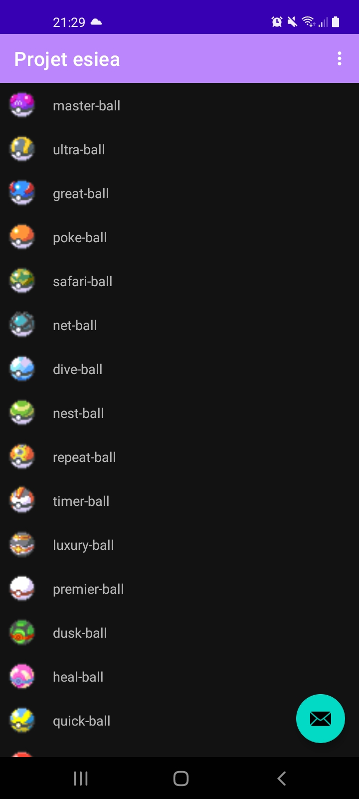
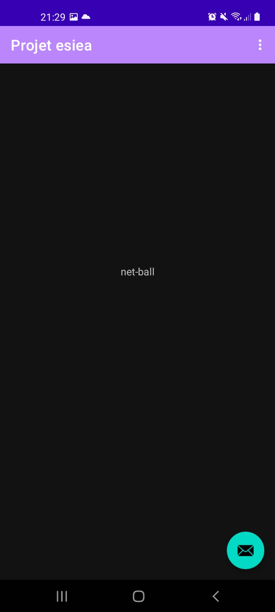
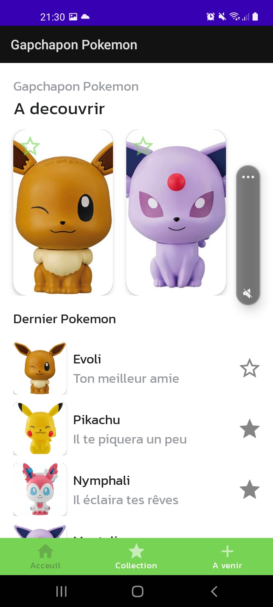
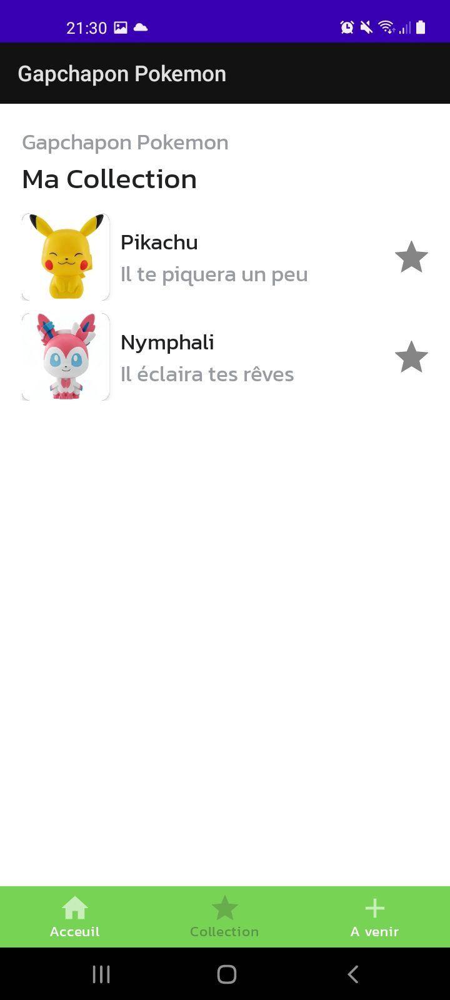
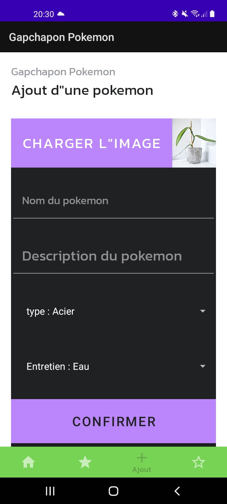
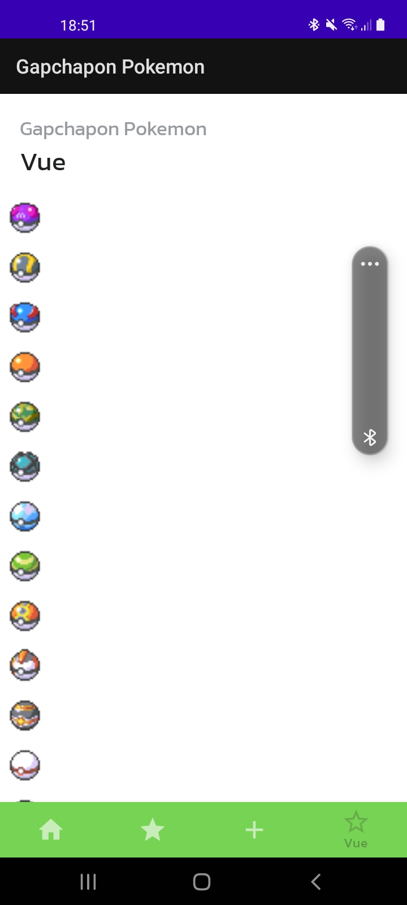

# ProjetTdEsiea
Ce project est fait par un débutant et comprend deux parties.
La première partie est finis et la seconde a quelque bug.
La première partie est tirée des td de Vincent Etienne durant l'année scolaire et la seconde d'internet mais principalement d'un tuto android venant de Graven un youtuber.
# Project partie1
Il affiche une liste d'item venant du jeu pokemon ainsi que leur nom.
L'application utilise l'Api Rest PokeApi.
Elle affiche la liste avec un recyclerview et les données sont stoquées via le cache http.
Elle comprend l'architecture Singleton et MVVM.

# Project partie2
La seconde partie a quelques erreurs  dans les deux derniers onglets(Ajouter et Vue) que je n'ai pas réussi à regler.
Elle affiche une liste de gapchapon et reprend api de la première partie.
On peut mettre en favoris les gapchapon qui nous interesses et en ajouter sur le site.
L'application utilise fireBase et sa base de donnée a temps reel.
Le design est personallisé pour qu'il corresponde à l'univers pokemon.

# Image Premier Project

# Image Second Project 

